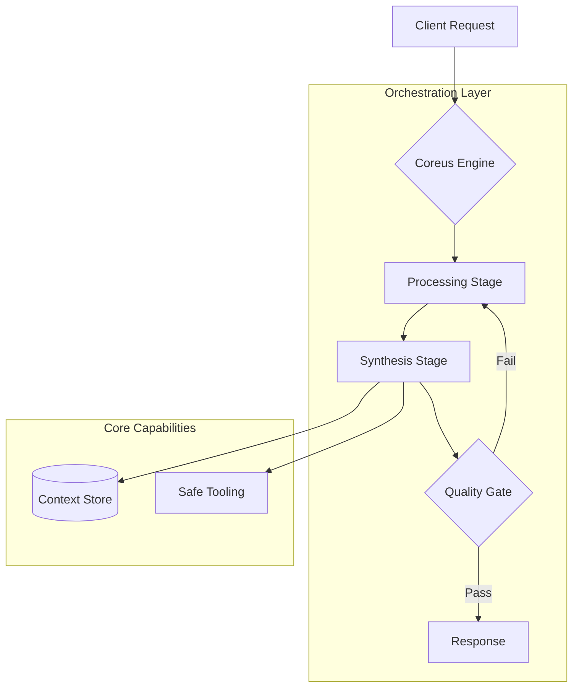

<div align="center">

# ⚙️ Coreus Framework
**The infrastructure layer for production-grade agentic systems.**


---

**[Overview](#-overview) • [The Problem](#-the-problem) • [Architecture](#-architecture) • [Core Components](#-core-components) • [Tech Stack](#-tech-stack)**

</div>

---

> ⚠️ **Showcase Edition** — This repository exposes the architectural philosophy, core interfaces, and abstraction layers of the Coreus Framework. Proprietary execution engines and internal mechanisms are not included in this reference distribution.

---

**Coreus** is a production-grade **Agentic Infrastructure Framework** designed to standardize the development of complex, multi-agent AI systems. Rather than reinventing reliability primitives for every project, Coreus provides a pre-validated structural foundation where engineering teams plug in their **business logic** and ship — without fighting the infrastructure.

Unlike high-level agent tools that give you a prefabricated house with unmovable walls, and unlike low-level libraries that hand you raw bricks, Coreus provides the **structural skeleton**: solid, secure, and fully extensible.

---

## 🔥 The Problem

Building a single AI agent is straightforward. Orchestrating a team of agents that must maintain shared state, handle failures gracefully, and self-correct over extended operation is a different class of problem entirely.

Three failure modes emerge at production scale — and they are not solved by better prompts:

- **🌀 State Drift** — How do you keep 5 agents synchronized when one fails mid-task?
- **🧠 Context Corruption** — How do you prevent hallucination when session memory leaks across contexts?
- **🔇 Silent Failures** — How do you detect when an agent returns a *valid-looking* but semantically incorrect response?

> Coreus solves these with **software engineering**, not prompt engineering.

---

## 🏗 Architecture

The framework is built on three engineering principles, each targeting a specific class of production failure.



### 🔁 Stateful Flow Engine

Unlike sequential chains, Coreus uses a **Stateful Flow Engine** where loops, parallel branches, and dynamic rerouting are first-class primitives. Execution state is immutable — enabling reliable history tracking, replay, and audit without additional instrumentation.

### 🗄️ Sandbox Memory Architecture

Memory is treated as a **Unified Context Store** with transactional boundaries. Partial writes are prevented at the storage layer. Each session is strictly sandboxed — context from one user or task cannot leak into another, eliminating an entire class of hallucination failure.

### 🛡️ Architectural Safeguards

Critical paths are protected by infrastructure-level stability patterns. Rather than crashing under load or API timeouts, the engine gracefully degrades — converting fatal errors into manageable state transitions. The system recovers; it does not restart.

---

## 🧩 Core Components

This repository exposes the foundational abstractions of the framework:

- **🤖 Agent Abstractions** — Base classes defining the agent lifecycle: initialization, tool access, state transitions, and teardown. Business logic slots in; infrastructure is inherited.
- **🔧 Tool Interface** — Standardized wrappers for external tool integration with built-in rate limiting, retry logic, and error classification.
- **💾 Memory Interface** — Pluggable context store definitions. Swap backends (in-memory, Redis, vector store) without touching agent logic.
- **✅ Evaluation Interface** — Quality gate contracts for validating agent outputs before they propagate downstream — catching semantic errors, not just exceptions.
- **📐 Typing Layer** — Shared data models for inter-agent communication. Strict schemas prevent malformed payloads from silently corrupting downstream state.

---

## ⚡ Real-World Scenarios

> **🛒 E-Commerce — Safety First**
> A "Style Consultant" agent carries brand risk if it hallucinates product recommendations. Coreus's **internal validation policies** intercept agent suggestions before they reach the frontend. Wrong answers are corrected within the system loop — users never see them.

> **📈 Scale-Up — From Prototype to Production**
> A script that works for 10 users crashes at thousands due to race conditions and API timeouts. Coreus's **infrastructure-level stability patterns** absorb load without architectural rewrites. Memory isolation ensures the prototype's logic survives the transition intact.

> **🏛️ Legacy Integration — Safe Hybrid Transition**
> A large legacy transaction system needs AI capability without a full rewrite. Coreus's **routing layer** splits traffic: simple transactions go to the existing system, complex analyses route to Coreus agents. Both systems run in parallel until full migration.

---

## 🛠 Tech Stack

<div align="center">
  
  &nbsp;&nbsp;
  
  &nbsp;&nbsp;
  
</div>

<br/>

- **Orchestration:** Stateful Flow Engine (custom)
- **Memory Backends:** In-memory · Redis · Vector Store (pluggable)
- **Quality Gates:** Configurable validation policy layer
- **LLM Adapters:** OpenAI · Anthropic · local models (via unified interface)
- **Typing:** Pydantic v2

---

## 📂 Project Structure

```text
coreus/
├── abstractions/     # Agent and Tool base classes
├── typing/           # Shared data models for inter-agent communication
├── interfaces/       # Memory, Evaluation, and Routing contracts
├── engine/           # Flow engine core (partial — showcase edition)
└── examples/         # Reference implementations
```

---

<div align="center">

<br/>

*Building reliable agents is not a prompting problem.*
*It is an engineering problem — and Coreus is the foundation.*

<br/>

*Coreus Framework Reference Architecture © 2026*

</div>
