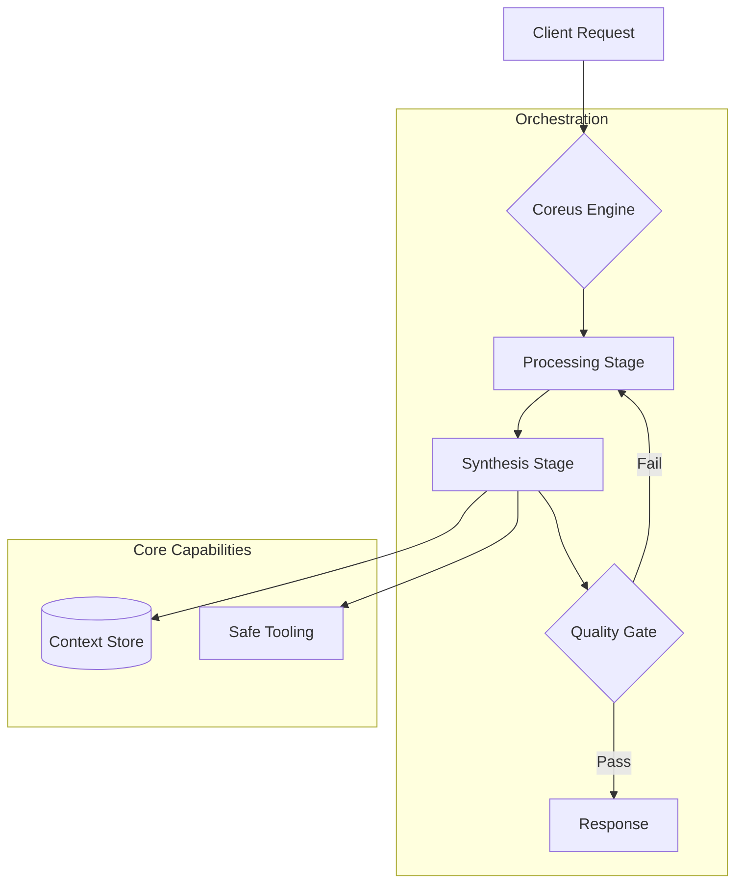

# COREUS FRAMEWORK (Showcase Edition)
**Agentic Infrastructure Framework**

> **⚠️ NOTE:** This repository is a public showcase of the Coreus Framework. It demonstrates the architectural philosophy, core interfaces, and abstraction layers designed for high-reliability AI systems. The proprietary execution engines and internal mechanisms are not included in this reference distribution.

---

## Strategic Vision

COREUS is an infrastructure architecture designed to standardize the development of complex AI agent systems. It provides a robust infrastructure for building scalable, secure, and predictable autonomous workflows.

Instead of reinventing the wheel for every project, Coreus offers a pre-validated structure where **engineering teams** can plug in their **Business Logic** and start running immediately.

### The Smart Infrastructure Concept
In the software world, you often have to choose between two extremes:

*   **Low-Level Libraries:** They give you **bricks and mortar**; what you build and how you ensure its safety is entirely up to you. This flexibility is liberating but exhausting.
*   **High-Level Agent Tools:** Like a **prefabricated house**; fast to set up, but often impossible to change the walls.

> **COREUS provides you with a "Smart Building Skeleton".**
> On this solid and secure infrastructure, you can freely build your own rooms—your **Business Logic**.

---

## The Challenge of Agentic Systems

Building a single AI agent is easy. Orchestrating a team of agents that must maintain state, handle failures, and correct themselves over days of operation is exponentially harder. 

Coreus addresses three fundamental problems that arise in production:
1.  **State Drift:** How do you keep 5 agents in sync when one fails?
2.  **Context Corruption:** How do you prevent hallucination when specific memory leaks into the wrong session?
3.  **Silent Failures:** How do you detect when an agent returns a "valid" but semantically incorrect answer?

> Coreus solves these not with more prompts, but with **Software Engineering**.

---

## Architectural Philosophy & Solution

The framework is built on specific engineering principles aimed at operational excellence.

### 1. Flexible Orchestration
Unlike traditional sequential chains, Coreus utilizes a **Stateful Flow Engine**. The engine supports flexible orchestration where loops, parallel branches, and dynamic rerouting are first-class citizens. The execution state is immutable, enabling reliable history tracking.

### 2. Sandbox Memory Architecture
Memory is treated as a **Unified Context Store**.
*   **Data Integrity:** The storage layer enforces strict transactional boundaries. Partial corruption is strictly prevented.
*   **Semantic Isolation:** Each user session is sandboxed, preventing context leakage.

### 3. Intelligent Flow & Stability
Real intelligence is iterative. Critical infrastructure is protected by **architectural safeguards** to gracefully degrade service rather than crashing under load, converting fatal errors into manageable state transitions.

---

## Real-World Scenarios & Solutions

> **Scenario 1: The E-Commerce Integrator (Safety First)**
> *   **Situation:** Implementing a "Style Consultant" bot carries brand risk if the AI hallucinates.
> *   **Coreus Effect:** Teams use **internal validation policies** to check agent suggestions before showing them to the user. Wrong answers are corrected within the system loop without ever reaching the frontend.

> **Scenario 2: The Scale-Up Crisis (Stability)**
> *   **Situation:** A prototype script works perfectly for 10 users but crashes as traffic hits thousands due to race conditions and API timeouts.
> *   **Coreus Effect:** The **Infrastructure-level stability patterns** keep the system standing under load. Memory isolation ensures a safe transition from prototype to production without requiring an architectural rewrite.

---

## Use Cases: Development Journey

> **Use Case A: "Solo Entrepreneur"**
> *   **Goal:** Build a personal "Legal Advisor Bot".
> *   **Process:** The entrepreneur activates Coreus's memory module and sets the rules.
> *   **Result:** Without dealing with infrastructure code, they launch a professional SaaS product focusing only on legal knowledge.

> **Use Case B: "Legacy Transformation"**
> *   **Goal:** Add AI capability to a huge legacy transaction system.
> *   **Process:** The team uses Coreus's **Routing** structure. Simple transactions go to the old system, complex analyses to Coreus agents.
> *   **Result:** A safe hybrid transition without discarding the current system.

---

## Core Components (Public Interfaces)

This repository exposes the foundational abstractions of the framework:

1.  **Abstractions:** Base classes for Agents and Tools.
2.  **Typing:** Standardized data models for inter-agent communication.
3.  **Interfaces:** Definitions for Memory and Evaluation modules.

---

*Coreus Framework Reference Architecture © 2026*
